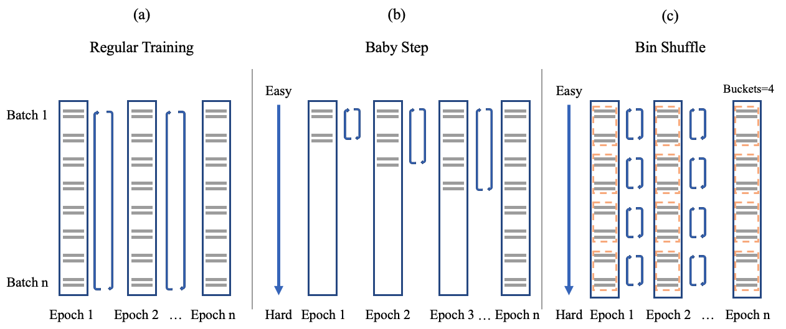

# CurriculumText

CurriculumText is an experimental implementation of [FastText](https://fasttext.cc/)
that allows training with curriculum learning. The code implements a few basic 
difficulty measures and training schedulers to boost performance on most text classification 
tasks. 

## Setup

Requirements:

- Install Anaconda
- Run `conda env create -f environment.yml` and `conda activate curriculum` on completion
- Download the [Glove 50B vectors](https://nlp.stanford.edu/data/glove.6B.zip) and save & extract them in the `data/` directory


## Run instructions

To reproduce the results, please run the following from the repository root:

For the full experiment run: 
```
python -m curriculumtext --mode full
```

To run best-performing models across multiple seeds: 
```
python -m curriculumtext --mode seed
```

You will see all experimental results as a long table stored in the `data/results/` directory. 
The jupyter notebook in `notebooks/report.ipynb` reads in the results table and aggregates them
into the format presented in the final report.

## Implementation Details

`CurriculumText` extends `FastText` by implementing easy CurriculumLearning through two key components: 

1. **DifficultyMeasurer**: What is a difficult document?  
2. **TrainingScheduler**: What degree of difficulty should the model be presented with at which stage during training?

### Difficulty Measures

Difficulty measures are implemented as `DifficultyMeasure` class in `curriculum_text/difficulty.py`.

- `.length()`: Length of lemmatized document/sample; works well for Neural Translation
- `.vector_distance()`: Distance of the averaged GloVe embeddings of the lemmatized words in the document and the 
document label; works well for topic & sentiment classification 
- `.reverse_length()`: Like `.length()`, but using "hard-to-easy" ordering, which is might prove useful if for tasks
where longer documents are considered easier

A sensible further difficulty measure to implement would be to use parse tree depth to capture grammatical
complexity. 


### Training Schedules

Training schedules are implemented in the `TraininScheduler` class in `curriculum/scheduler.py`.

a) `.train_full()`: Regular training loop, shuffling samples after each epoch

b) `.train_baby_step()`: Progressively increasing sample difficulty through training epochs, with last 5 epochs training
on full data

c) `.train_bin_shuffle()`: Divides samples into equal-size bins ordered by difficulty. Bin order does not change across
epochs, but samples are shuffled within bins


